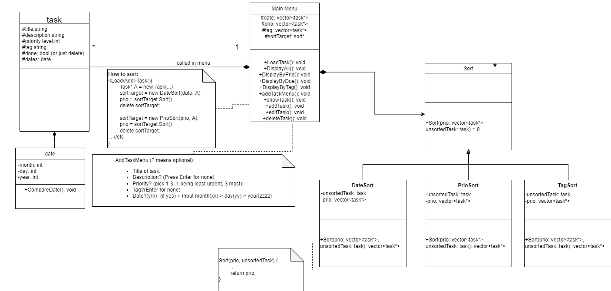

# Task Manager
 > Authors: [Ainaz Estiri](https://github.com/AinazEstiri), [Jason Lo](https://github.com/lojason71), [Brandon Hoang](https://github.com/brandoh4258), [Brandon Nguyen](https://github.com/penwin2468), and [Yenna Chang](https://github.com/ychan092)


## Phase I: Project Description

### Why is this project important to us?
Task managers are helpful when juggling multiple responsibilities, ensuring deadlines are met in a proactive manner, and staying organized. In the form of a comprehensive to-do list, we aimed to create a space where the user has a visual representation of the tasks they must accomplish. Our group hopes that the program is a useful productivity tool for students and professionals who aim to be more productive with less stress.

### Languages/Tools/Technologies Used
	* C++
	* Google Tests
	* Valgrind
	* CMake/Makefile
   
### Input/Output & Features
A user can create tasks that include a title, description, classification (e.g. personal, work, study), priority, and a due date. Additional features are optional, so the user can customize their list to be as comprehensive or simple as they choose. This list can represent larger tasks with subtasks within them or be a simple to-do list. Users can also display, edit, and delete tasks through the main menu.

## Phase II: Design

### Task Manager Prototype Pattern


Main menu implements a user interface for the user to edit/delete/create tasks. Sort class sorts tasks into three different categories. Tasks itself contains the attributes that the user would like to track, sort, and find.

1. The intent of the strategy pattern is to encapsulate an algorithm. In particular, we can encapsulate multiple implementations of similar algorithms. We can also extend the number of different strategies at will. Ultimately, to implement different algorithms appropriate to the user’s different situations.

2. We chose to implement a strategy pattern because, we had multiple sorting strategies/algorithms to use dynamically during run-time.

3. Coding a strategy pattern allows us to think in modules, it also eliminates conditional statements. Additionally, it helps us understand the nature of composition and inheritance relationships. The pattern also teaches us on a great use of encapsulation.
 
## Phase III: Development, Testing and Scrum Meeting

We ensured that all of our unit test cases conform to the Google Test Framework. These test executables are initially run on our local machines to validate their functionality.

Some unit test cases include:
```
TEST(outputOldUserCSV, EmptyCSV) {
	string userName = "unittest1";
	MainMenu menu;
	menu.outputOldUserFile(userName);
	EXPECT_EQ(menu.getDateSize(), 0);
}

TEST(deleteTask, SuccesfulDeletion) {
	string title = "Doggy";
	MainMenu test;

	Task* A = new Task("Doggy", "It's an animal", 3, "Dog");

	test.addTask(A);	
	test.deleteTask(title);

	EXPECT_EQ(test.getDateSize(), 0);
}

TEST(deleteTask, FailedDeletion) {
        string title = "Doggy";
        MainMenu test;

        Task* A = new Task("Doggy", "It's an animal", 3, "Dog");

        test.addTask(A);
        test.deleteTask("Catty");

        EXPECT_NE(test.getDateSize(), 0);
}

TEST(addTask, TaskAddition) {
	MainMenu test;
        Task* A = new Task("Doggy", "It's an animal", 3, "Work");

	test.addTask(A);
	
	EXPECT_EQ((test.getDateSize() +	test.getPrioSize() + test.getTagSize()) / 3, 1);
	
}

TEST(addTask, NewTaskTitle) {
        MainMenu test;
        string total="";
        string title="";
        string desc= "";
        string prio= "";
        string tag= "";
        Task* A = new Task("Doggy", "", 0, "");

        test.addTask(A);

        title=  test.GetDates().at(0)->getTitle();
        desc=  test.GetDates().at(0)->getDesc();
        prio= to_string(test.GetDates().at(0)->getPrio());
        tag= test.GetDates().at(0)->getTag();
        total += title + desc + prio + tag;
        EXPECT_EQ(total, "Doggy0");
}

TEST(addTask, TaskDesc) {
        MainMenu test;
        string total="";
        string title="";
        string desc= "";
        string prio= "";
        string tag= "";
        Task* A = new Task("Doggy", "Poops A lot :)", 0, "");
        
	test.addTask(A);

        title=  test.GetDates().at(0)->getTitle();
        desc=  test.GetDates().at(0)->getDesc();
        prio= to_string(test.GetDates().at(0)->getPrio());
        tag= test.GetDates().at(0)->getTag();
        total += title + desc + prio + tag;
        
        EXPECT_EQ(total, "DoggyPoops A lot :)0");
}

TEST(addTask, TaskPrio) {
        MainMenu test;
        string total="";
        string title="";
        string desc= "";
        string prio= "";
        string tag= "";
        Task* A = new Task("Doggy", "Poops A lot :)", 3, "");
 
        test.addTask(A);

        title=  test.GetDates().at(0)->getTitle();
        desc=  test.GetDates().at(0)->getDesc();
        prio= to_string(test.GetDates().at(0)->getPrio());
        tag= test.GetDates().at(0)->getTag();
        total += title + desc + prio + tag;

        EXPECT_EQ(total, "DoggyPoops A lot :)3");
}

TEST(addTask, TaskTag) {
        MainMenu test;
        string total="";
        string title="";
        string desc= "";
        string prio= "";
        string tag= "";
        Task* A = new Task("Doggy", "Poops A lot :)", 2, "Other");

        test.addTask(A);

        title=  test.GetDates().at(0)->getTitle();
        desc=  test.GetDates().at(0)->getDesc();
        prio= to_string(test.GetDates().at(0)->getPrio());
        tag= test.GetDates().at(0)->getTag();
        total += title + desc + prio + tag;

        EXPECT_EQ(total, "DoggyPoops A lot :)2Other");
}

TEST(addTask, TaskRandom) {
        MainMenu test;
        string total="";
        string title="";
        string desc= "";
        string prio= "";
        string tag= "";
        Task* A = new Task("student", "", 1, "Study");

	test.addTask(A);

        title=  test.GetDates().at(0)->getTitle();
        desc=  test.GetDates().at(0)->getDesc();
        prio= to_string(test.GetDates().at(0)->getPrio());
        tag= test.GetDates().at(0)->getTag();
        total += title + desc + prio + tag;

        EXPECT_EQ(total, "student1Study");
}

TEST(addTask, TaskFull) {
        MainMenu test;
        string total="";
        string title="";
        string desc= "";
        string prio= "";
        string tag= "";
        Task* A = new Task("student", "Homwork 4 and Job 2", 1, "Study");

	test.addTask(A);

        title=  test.GetDates().at(0)->getTitle();
        desc=  test.GetDates().at(0)->getDesc();
        prio= to_string(test.GetDates().at(0)->getPrio());
        tag= test.GetDates().at(0)->getTag();
        total += title + desc + prio + tag;

        EXPECT_EQ(total, "studentHomwork 4 and Job 21Study");
}

TEST(addTask, TaskDescTag) {
        MainMenu test;
        string total="";
        string title="";
        string desc= "";
        string prio= "";
        string tag= "";
        Task* A = new Task("student", "I hate my life", 0, "Personal");

	test.addTask(A);

        title=  test.GetDates().at(0)->getTitle();
        desc=  test.GetDates().at(0)->getDesc();
        prio= to_string(test.GetDates().at(0)->getPrio());
        tag= test.GetDates().at(0)->getTag();
        total += title + desc + prio + tag;

        EXPECT_EQ(total, "studentI hate my life0Personal");
}

TEST(addTask, TaskPrioTag) {
        MainMenu test;
        string total="";
        string title="";
        string desc= "";
        string prio= "";
        string tag= "";
        Task* A = new Task("Mom", "", 2, "Business");

        test.addTask(A);

        title=  test.GetDates().at(0)->getTitle();
        desc=  test.GetDates().at(0)->getDesc();
        prio= to_string(test.GetDates().at(0)->getPrio());
        tag= test.GetDates().at(0)->getTag();
        total += title + desc + prio + tag;

        EXPECT_EQ(total, "Mom2Business");
}

TEST(addTask, TaskWeird) {
        MainMenu test;
        string total="";
        string title="";
        string desc= "";
        string prio= "";
        string tag= "";
        Task* A = new Task("Mom", "1.Do This 2.read-_= +*+ UwU @^@ $#%3. Sleep", 1, "Event");

        test.addTask(A);

        title=  test.GetDates().at(0)->getTitle();
        desc=  test.GetDates().at(0)->getDesc();
        prio= to_string(test.GetDates().at(0)->getPrio());
        tag= test.GetDates().at(0)->getTag();
        total += title + desc + prio + tag;

        EXPECT_EQ(total, "Mom1.Do This 2.read-_= +*+ UwU @^@ $#%3. Sleep1Event");
}

TEST(showTask, taskDisplay) {
	MainMenu test;
	Task* A = new Task("Doggy", "It's an animal", 3, "Dog");
	Task* B = new Task("Catto", "It's a monster", 2, "Cat");

	test.addTask(A);
	test.addTask(B);

        EXPECT_EQ(test.getPrintedList(test.GetDates()), test.getPrintedList(test.GetPriorities()));
}
```
These 14 tests would yeild the results:
```
[==========] Running 14 tests from 4 test suites.
[----------] Global test environment set-up.
[----------] 1 test from outputOldUserCSV
[ RUN      ] outputOldUserCSV.EmptyCSV
Failed to open old user file AllUserNames/unittest1.csv
unittest1's profile has been created instead.
[       OK ] outputOldUserCSV.EmptyCSV (0 ms)
[----------] 1 test from outputOldUserCSV (0 ms total)

[----------] 2 tests from deleteTask
[ RUN      ] deleteTask.SuccesfulDeletion

[       OK ] deleteTask.SuccesfulDeletion (0 ms)
[ RUN      ] deleteTask.FailedDeletion

[       OK ] deleteTask.FailedDeletion (0 ms)
[----------] 2 tests from deleteTask (0 ms total)

[----------] 10 tests from addTask
[ RUN      ] addTask.TaskAddition

[       OK ] addTask.TaskAddition (0 ms)
[ RUN      ] addTask.NewTaskTitle

[       OK ] addTask.NewTaskTitle (0 ms)
[ RUN      ] addTask.TaskDesc

[       OK ] addTask.TaskDesc (0 ms)
[ RUN      ] addTask.TaskPrio

[       OK ] addTask.TaskPrio (0 ms)
[ RUN      ] addTask.TaskTag

[       OK ] addTask.TaskTag (0 ms)
[ RUN      ] addTask.TaskRandom

[       OK ] addTask.TaskRandom (0 ms)
[ RUN      ] addTask.TaskFull

[       OK ] addTask.TaskFull (0 ms)
[ RUN      ] addTask.TaskDescTag

[       OK ] addTask.TaskDescTag (0 ms)
[ RUN      ] addTask.TaskPrioTag

[       OK ] addTask.TaskPrioTag (0 ms)
[ RUN      ] addTask.TaskWeird

[       OK ] addTask.TaskWeird (0 ms)
[----------] 10 tests from addTask (0 ms total)

[----------] 1 test from showTask
[ RUN      ] showTask.taskDisplay

[       OK ] showTask.taskDisplay (0 ms)
[----------] 1 test from showTask (0 ms total)

[----------] Global test environment tear-down
[==========] 14 tests from 4 test suites ran. (0 ms total)
[  PASSED  ] 14 tests.
```
## Inputs and Outputs
### New User Startup Menu
```
---------------------------------------
|           W E L C O M E             |
---------------------------------------
---------------------------------------
|           Are you a new user?       |
|           y - Yes                   |
|           n - No                    |
---------------------------------------
y
---------------------------------------
|       Please enter a username       |
|          (case sensitive)           |
---------------------------------------
ychan092  
AllUserNames/ychan092.csv is created!
---------------------------------------
|      What would you like to do?     |
|      a - Add a task                 |
|      d - Delete a task              |
|      e - Edit a task                |
|      s - Show all tasks             |
|      q - Close program              |
---------------------------------------
a
```
### Add Task Menu
```
---------------------------------------
|         Enter Title of Task:         |
---------------------------------------
Update resume
title set:Update resume
---------------------------------------
|         Description for task?        |
|        (Press Enter for none)        |
---------------------------------------
Add Task Manager project item
set description:Add Task Manager project item
---------------------------------------
|          Priority for task?          |
|          Pick 1 for least important  |
|          Pick 2 for important        |
|          Pick 3 for most important   |
|         (Press n for not important)  |
---------------------------------------
2
entered:2
---------------------------------------
|          Tag the task?               |
|          h - homework                |
|          s - study                   |
|          p - personal                |
|          b - business                |
|          e - event                   |
|          w - work                    |
|          o - other                   |
|         (Press n for no tag)         |
---------------------------------------
p
entered:p
---------------------------------------
|           Need a due date?          |
|               y- yes                |
|               n- no                 |
---------------------------------------
y
entered yes (yes date)
---------------------------------------
|      Input month in form (xx)       |
|        Example: July--> 07          |
---------------------------------------
07
Month:7
---------------------------------------
|      Input day in form (xx)          |
|        Example: day--> 28            |
---------------------------------------
12
Day:12
---------------------------------------
|       Input year in form (xxxx)      |
|      Example: year 2022--> 2022      |
---------------------------------------
2023
Year:2023

Tasks successfully saved in AllUserNames/ychan092.csv
```
### Show Task menu
```
---------------------------------------
|      What would you like to do?     |
|      a - Add a task                 |
|      d - Delete a task              |
|      e - Edit a task                |
|      s - Show all tasks             |
|      q - Close program              |
---------------------------------------
s
--------------------------------------------------------------------------------
| Would you like to display your tasks in order by dates, priorities, or tags? |
|            Enter 1 for dates, 2 for priorities, 3 for tags.                  |
|          Enter 0 if you would like to print by date added.                        |
--------------------------------------------------------------------------------
0

----------------------------
1) Update resume
Due Date(mm/dd/yyyy): 7/12/2023
Prio: 2|Tag: Personal
Desc:Add Task Manager project item
----------------------------
```
### Edit Task menu
```
---------------------------------------
|      What would you like to do?     |
|      a - Add a task                 |
|      d - Delete a task              |
|      e - Edit a task                |
|      s - Show all tasks             |
|      q - Close program              |
---------------------------------------
e
--------------------------------------------
|       What would you like to edit?       |
|         A. Title                         |
|         B. Description                   |
|         C. Tag                           |
|         D. Priority                      |
|         E. Date                          |
|       Press Q to Exit.                   |
---------------------------------------------
b

--------------------------------------------------------------------
|      Please enter the title the task you would like to edit.     |
--------------------------------------------------------------------
----------------------------
1) Update resume
Due Date(mm/dd/yyyy): 7/12/2023
Prio: 2|Tag: Personal
Desc:Add Task Manager project item
----------------------------

Update resume

-------------------------------------------
|     Please enter a new description.     |
--------------------------------------------
Add task manager project item

Okay. Description for Update resume has been changed to Add task manager project item.
----------------------------
1) Update resume
Due Date(mm/dd/yyyy): 7/12/2023
Prio: 2|Tag: Personal
Desc:Add task manager project item
----------------------------

Tasks successfully saved in AllUserNames/ychan092.csv
```
### Show Task menu
#### Sorting by date
```
---------------------------------------
|      What would you like to do?     |
|      a - Add a task                 |
|      d - Delete a task              |
|      e - Edit a task                |
|      s - Show all tasks             |
|      q - Close program              |
---------------------------------------
s
--------------------------------------------------------------------------------
| Would you like to display your tasks in order by dates, priorities, or tags? |
|            Enter 1 for dates, 2 for priorities, 3 for tags.                  |
|          Enter 0 if you would like to print by date added.                   |
--------------------------------------------------------------------------------
1

----------------------------
1) Update resume
Due Date(mm/dd/yyyy): 7/12/2023
Prio: 2|Tag: Personal
Desc:Add task manager project item
----------------------------
2) LeetCode
Due Date(mm/dd/yyyy): 7/13/2023
Prio: 1|Tag: Study
Desc:Complete daily LeetCode challenge
----------------------------
3) Email recruiter
Due Date(mm/dd/yyyy): 7/14/2023
Prio: 3|Tag: Business
Desc:Send recruiter resume
----------------------------
```
#### Sorting by priority
```
--------------------------------------------------------------------------------
| Would you like to display your tasks in order by dates, priorities, or tags? |
|            Enter 1 for dates, 2 for priorities, 3 for tags.                  |
|          Enter 0 if you would like to print by date added.                   |
--------------------------------------------------------------------------------
2

----------------------------
1) Email recruiter
Due Date(mm/dd/yyyy): 7/14/2023
Prio: 3|Tag: Business
Desc:Send recruiter resume
----------------------------
2) Update resume
Due Date(mm/dd/yyyy): 7/12/2023
Prio: 2|Tag: Personal
Desc:Add task manager project item
----------------------------
3) LeetCode
Due Date(mm/dd/yyyy): 7/13/2023
Prio: 1|Tag: Study
Desc:Complete daily LeetCode challenge
----------------------------
```
#### Sorting by tag
```
--------------------------------------------------------------------------------
| Would you like to display your tasks in order by dates, priorities, or tags? |
|            Enter 1 for dates, 2 for priorities, 3 for tags.                  |
|          Enter 0 if you would like to print by date added.                   |
--------------------------------------------------------------------------------
3

----------------------------
1) Email recruiter
Due Date(mm/dd/yyyy): 7/14/2023
Prio: 3|Tag: Business
Desc:Send recruiter resume
----------------------------
2) Update resume
Due Date(mm/dd/yyyy): 7/12/2023
Prio: 2|Tag: Personal
Desc:Add task manager project item
----------------------------
3) LeetCode
Due Date(mm/dd/yyyy): 7/13/2023
Prio: 1|Tag: Study
Desc:Complete daily LeetCode challenge
----------------------------
```
### Delete Task menu
```
---------------------------------------
|      What would you like to do?     |
|      a - Add a task                 |
|      d - Delete a task              |
|      e - Edit a task                |
|      s - Show all tasks             |
|      q - Close program              |
---------------------------------------
d
---------------------------------------
|  Enter Title of Task for Deletion:   |
---------------------------------------
LeetCode
---------------------------------------
|         ♪♪ Task Deleted!♪♪           |
---------------------------------------
```
### Old User Startup Menu
```
---------------------------------------
|           W E L C O M E             |
---------------------------------------
---------------------------------------
|           Are you a new user?       |
|           y - Yes                   |
|           n - No                    |
---------------------------------------
n
---------------------------------------
|       Please enter your username    |
|          (case sensitive)           |
---------------------------------------
ychan092
AllUserNames/ychan092.csv has been accessed!
```
#### After deleting the LeetCode task item and reloading the user's tasks the output yeilds:
```
--------------------------------------------------------------------------------
| Would you like to display your tasks in order by dates, priorities, or tags? |
|            Enter 1 for dates, 2 for priorities, 3 for tags.                  |
|          Enter 0 if you would like to print by date added.                   |
--------------------------------------------------------------------------------
0

----------------------------
1) Update resume
Due Date(mm/dd/yyyy): 7/12/2023
Prio: 2|Tag: Personal
Desc:Add task manager project item
----------------------------
2) Email recruiter
Due Date(mm/dd/yyyy): 7/14/2023
Prio: 3|Tag: Business
Desc:Send recruiter resume
----------------------------
```
### Exiting Program Message
```
---------------------------------------
|      What would you like to do?     |
|      a - Add a task                 |
|      d - Delete a task              |
|      e - Edit a task                |
|      s - Show all tasks             |
|      q - Close program              |
---------------------------------------
q
Tasks successfully saved in AllUserNames/ychan092.csv
---------------------------------------
|           G O O D B Y E             |
---------------------------------------
```
## Installation/Usage
To use this program, first clone the repository `git clone https://github.com/cs100/final-project-bhoan008-jlo034-aesti002-bnguy225-ychan092.git`. Then, `cd` into the repo, configure cmake (`cmake .`, `make`), and lastly run `./TaskManager`.

> If not working, use this before cmake3: git submodule update --init --recursive

#### Follow the sequence within main.cpp as follows:
1. Ask if new user
2. Ask for a username
3. Ask for a title
4. Ask for a description (optional)
5. Ask for a priority (optional)
6. Ask for a tag (optional)
7. Ask for date (optional)
8. Choose option from menu to manage program
	* Add a task
	* Delete a task
	* Edit a task
	* Show all task
	* Close program 
	
#### Possible Error (cmake in particular):
```
CMake Error at CMakeLists.txt:7 (ADD_SUBDIRECTORY):
  The source directory

   /class/classes/bhoan008/final-project-bhoan008-jlo034-aesti002-bnguy225-ychan092/googletest

  does not contain a CMakeLists.txt file.


-- Configuring incomplete, errors occurred!
```
Use this command to fix this issue: 
```
$ git clone --recursive https://github.com/google/googletest.git
```


## Testing
We used Google Testing (Continuous Integration) for testing:
>

